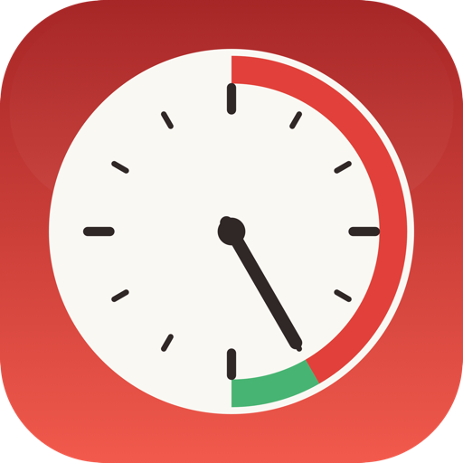

# focus



[](https://github.com/nchourrout/focus/actions/workflows/test.yml)
[](LICENSE)
[](#build--install)

A macOS menu bar app + CLI to get in the zone.

- **Block distracting websites** by editing `/etc/hosts`
- **Play focus music** from free, ad-free [SomaFM](https://somafm.com) streams (Drone Zone, Groove Salad, Mission Control, …) — or any HTTP(S) audio stream URL, or a local audio file
- **Run a pomodoro** as a detached daemon that blocks sites during work, plays music, and cleans up automatically. The block lifts during breaks so you can browse freely, then comes back when the next work phase starts. By default it keeps cycling (work → break → work …) with a longer break after every 4 sessions, until you stop it. Or have it stop after each set of 4 and ask whether to start another (with the same goal or a new one)
- **Global hotkeys** for start/stop pomodoro and toggle block, configurable in Settings
- **Launch at login** toggle via `SMAppService`
- One Swift binary is both the menu bar app (run with no args) and the CLI (run with a subcommand)

## Download

Pre-built `.app` zips are attached to each [GitHub Release](https://github.com/nchourrout/focus/releases). Grab the latest, unzip, drag `Focus.app` to `/Applications`, then run:

```bash
xattr -dr com.apple.quarantine /Applications/Focus.app
open /Applications/Focus.app
```

The app is unsigned and unnotarized, so Gatekeeper blocks the first launch until that `xattr` runs (or right-click → Open → Open). The CLI symlink is not created by the zip download. If you want `focus` on `$PATH`, build from source (next section).

## Build & install

Requires macOS 13+ and Swift 5.10+. Xcode Command Line Tools are enough to build; `swift test` needs a full Xcode.

> KeyboardShortcuts is pinned to 1.15.0 to keep that true. 1.16.0+ use the `#Preview` macro and 3.x also uses SwiftUI's `@Entry`; both need macro plugins that only ship with the full Xcode.

```bash
git clone git@github.com:nchourrout/focus.git ~/dev/focus
cd ~/dev/focus
./Scripts/install.sh            # builds Focus.app, installs to /Applications,
                                # symlinks /usr/local/bin/focus → the inner binary
open /Applications/Focus.app    # launches the menu bar app
```

The first time you toggle the block, Focus pops a native admin password dialog and installs `/etc/sudoers.d/focus`. After that, all toggles and pomodoro auto-blocks run silently. You can also manage the permission from **Settings → General → Grant permission…** at any time.

Open **Settings…** from the menu (⌘,) to bind global hotkeys and toggle launch-at-login.

The `.app` is unsigned; `install.sh` strips the quarantine flag so Gatekeeper doesn't block first-open. If you ever see "Focus can't be opened because Apple cannot check it," run `sudo xattr -dr com.apple.quarantine /Applications/Focus.app`.

## Menu bar

Click the icon for a dropdown:

- **stopwatch icon** during work, **coffee cup** during the break, with a live `mm:ss` countdown next to it. Idle shows a dashed circle (or a slashed circle when the block is on)
- **Start pomodoro…** — prompts for a goal; replaced by **Stop pomodoro** while running
- **Block / Unblock websites** — toggles `/etc/hosts` (uses the sudoers drop-in)
- **Music** submenu — any preset, or Stop. The current station is named in the submenu title and check-marked in the list
- **Settings…** — tabbed window: General (work/break/long-break durations, session-cycling, stop-after-set, launch at login, sounds, music preset), Shortcuts (global hotkey recorders), Block list (the sites edited inline)
- **Quit Focus**

Menu actions shell out to the same binary in CLI mode, so `~/.focus-pomodoro.json` stays the single source of truth. The menu bar polls it once a second. It passes no flags when starting a pomodoro: the CLI reads the same Settings it would, so there's only one place the rules live.

## CLI

```bash
focus --version                  # print the app version

focus status                     # human-readable block status
focus status --json              # {"active": true|false}

sudo focus block                 # block sites from the bundled block.txt
sudo focus unblock               # remove the block
sudo focus toggle --json         # toggle; emits the new state

focus music --list               # built-in SomaFM streams
focus music groovesalad          # stream a preset
focus music https://stream.url   # any HTTP(S) audio stream
focus music --file ~/brown.mp3 --loop
focus music --stop

focus pomodoro start "write spec"                 # uses your Settings, cycles until stopped
focus pomodoro start "deep work" --work 50 --break 10 --music groovesalad
focus pomodoro start "quiet hour" --no-block      # skip the site block for one run
focus pomodoro status                             # add --json for machine-readable
focus pomodoro stop

# Every flag is an override. Omit one and the session uses your Settings value
# (25min work / 5min break out of the box), so the CLI and the menu bar start
# identical sessions.
#
# Session cycling and the long break (every 4th break, 15min by default) are
# configured in Settings → General. Turn cycling off there for one-and-done runs,
# or enable "Stop after each set" to pause at every 4th session. A notification
# then lets you start another set with the same goal, or type a new goal inline.
# Those settings are re-read at each phase boundary, so changing one mid-run
# takes effect at the next work/break transition rather than the next run.
```

**Music sources**:
- **HTTP(S) streams** — built-in SomaFM presets, or any direct stream URL. Played via `AVPlayer` in a detached subprocess.
- **Local audio files** — `--file PATH`, with optional `--loop`. Played via `afplay`.

A pomodoro picks its music in this order: the `--music` flag, then the **Start music with pomodoro** preset in Settings, then `FOCUS_MUSIC_URI` (which also applies when the preset is **None**). Set `FOCUS_MUSIC_URI` in your shell to give `focus music` with no args a default too. A `--music` value that names no preset is an error; an unusable `FOCUS_MUSIC_URI` (a local file, say) just means the pomodoro starts without music.

## Sudoers (system permission)

`block`, `unblock`, and `toggle` need root because they write `/etc/hosts`. The pomodoro daemon runs them non-interactively via `sudo -n`, so a `NOPASSWD` entry is required in `/etc/sudoers.d/focus`.

Focus installs it itself — no separate shell script:

- On the first Hyper+B / Block toggle, the app detects the missing drop-in and prompts with the **native macOS admin password dialog** (same UX as Xcode, Homebrew-cask, etc.). Enter your password once; the rule is written after `visudo -cf` validation.
- You can re-run the install from **Settings → General → Grant permission…** at any time (e.g. if the binary path changes).

The generated rule whitelists `block`, `unblock`, and `toggle` against the Focus.app binary path, including the documented flag combinations (`--no-block-doh`, `--json`). No wildcards. See [`SudoersInstaller.renderRule`](Sources/Focus/Core/SudoersInstaller.swift) for the exact lines.

## State files

- `/etc/hosts` — block entries between `# === FOCUS BLOCK START/END ===` markers
- `/etc/hosts.backup` — first-block backup
- `~/.focus-pomodoro.json` — active session (goal, pid, started_at, work_end, break_end, music, block, session_number, is_long_break, set_complete)
- `~/.focus-music.pid` — playback PID and the station label (`pid\nlabel`), so `--stop` can reach it and the menu bar can name what's playing

## Logs

The pomodoro daemon and the music subprocesses are detached, with their stdio on `/dev/null` — they outlive the shell that started them, so anything they print is lost. Their diagnostics go to Unified Logging instead:

```bash
log stream --predicate 'subsystem == "com.nchourrout.focus"'      # live
log show --last 30m --predicate 'subsystem == "com.nchourrout.focus"'
```

Or Console.app, filtered on the subsystem. Categories are `daemon` (the run loop and its block calls), `playback`, `actions`, `launch-at-login`, and `terminate`.

Worth knowing: a failing `sudo -n block` is the quietest thing Focus can do wrong. The session runs normally and the state file says `block: true`, but the sites stay reachable. That failure is logged under `daemon` with sudo's own stderr attached, which is the fastest way to tell a missing `/etc/sudoers.d/focus` from a rule that doesn't list the binary path you're running.

## Testing

Unit tests under `Tests/FocusTests/` use Swift Testing (`#expect`, `@Test`). CI runs them on every push via GitHub Actions — see the badge at the top.

Locally with a full Xcode install:

```bash
swift test
```

Without Xcode, `swift build` still works; only `swift test` needs the full toolchain.

## Releasing

Single source of truth for `CFBundleShortVersionString` is the `VERSION` file at the repo root.

```bash
./Scripts/release.sh 0.6.0      # bumps VERSION, commits "Release v0.6.0", tags v0.6.0
git push && git push origin v0.6.0
```

The tag push triggers `.github/workflows/release.yml`, which builds `Focus.app` on a clean macos-15 runner, zips it with `ditto`, and attaches `Focus-v0.6.0.zip` to a new GitHub Release.

## License

MIT — see [LICENSE](LICENSE).
